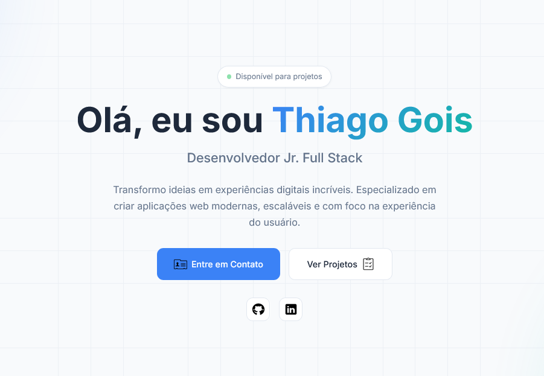

# Meu Portfólio Pessoal 👨‍💻

> Bem-vindo ao repositório do meu portfólio web! Este projeto foi desenvolvido para apresentar minhas habilidades, projetos e experiências na área de desenvolvimento.

---

## 🌐 Acesso ao Projeto

Você pode visualizar o portfólio online diretamente através do link abaixo (hospedado no GitHub Pages):

**[Acessar Portfólio Online](https://thiagogoislira.github.io/portfolio/)**

---

## 🛠️ Tecnologias Utilizadas

Este projeto foi construído utilizando as seguintes tecnologias:

* **HTML5:** Estruturação semântica do site.
* **CSS3:** Estilização, layout e responsividade (Mobile First).
* **JavaScript:** Interatividade e animações da página.
* **Git & GitHub:** Versionamento de código e hospedagem.

---

## ✨ Funcionalidades

* **Design Responsivo:** O layout se adapta perfeitamente a smartphones, tablets e desktops.
* **Seção "Sobre Mim":** Um resumo da minha trajetória e objetivos.
* **Galeria de Projetos:** Exibição dos meus principais trabalhos com links para repositórios e *Live Previews*.
* **Contato:** Links para as minhas redes sociais e informações de contato.

---
